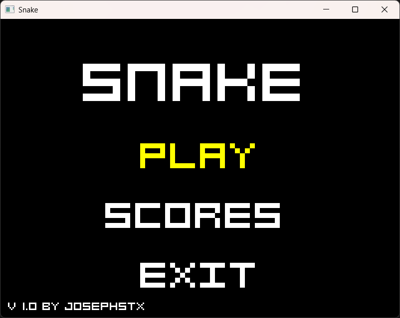
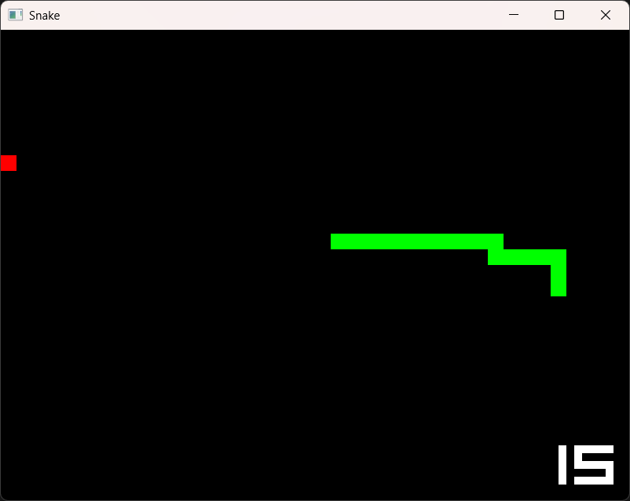
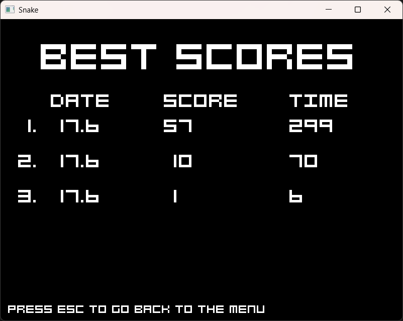

# SNAKE GAME 🐍🕹️

## GAME DESCRIPTION 🎮

*Snake Game is a classic arcade-style game recreated using **C++** and **SFML**.*

*The player controls a snake that grows by eating food while avoiding collisions with itself and the screen boundaries.*

*The project focuses on learning **game development fundamentals**, including game loops, input-handling and audio integration.*

## FEATURES ✨

- *Smooth snake movement using grid-based logic*
- *Collision detection (self and walls)*
- *Food and Snake spawning system*
- *Score system*
- *Game over state*
- *Real-time input-handling*
- *Sound effects for:*
  - *Eating food*
  - *Game over*
  - *Menu selection*
- *Frame-based rendering system*

## LIBRARIES 🛠️

*This proyect uses the **SFML Graphic Library** (v 3.0.2) and the following modules*

- *SFML Graphics*
- *SFML Window*
- *SFML System*
- *SFML Audio*

## RENDERING SYSTEM 🎨

*The game uses SFML's 2D rendering system to draw shapes every frame*

- *The snake is drawn using green pixels*
- *The food is rendered by a red pixel*
- *The font implements an algorithm using a boolean matrix for each character*

*This process draws many frames per second updating the screen*

## AUDIO SYSTEM 🔊

*Sound effects are created using **FL Studio** and played in-game using **SFML Audio module***

## HOW TO RUN? 🎮

**Requirements**

- *SFML (v 3.0 or later)*
- *C++ compiler (GCC / MinGW / MSVC)*
- *CMake (optional)*

**Compile manually**

   *Using GCC run the following command in your favorite terminal:*

   ```bash
   g++ source/*.cpp -o snake -Iinclude -lsfml-graphics -lsfml-window -lsfml-system -lsfml-audio
   ```

   *After, run the executable*

   - **Linux** 🐧

   ```bash
   mkdir exe
   mv snake exe
   cd exe
   ./snake
   ```

   - **Windows** 🪟

   ```bash
   mkdir exe
   move snake.exe exe
   cd exe
   snake.exe
   ```

**Using CMake**

   *Compile the game using the **CMakeList.txt** file, run these commands:*

   ```bash
   mkdir build
   cd build 

   cmake ..
   cmake --build .
   ```

   *After, run the executable*

   - **Linux** 🐧

   ```bash
   ./Snake
   ```

   - **Windows** 🪟

   ```bash
   Snake.exe
   ```

## SCREENSHOTS 📸








